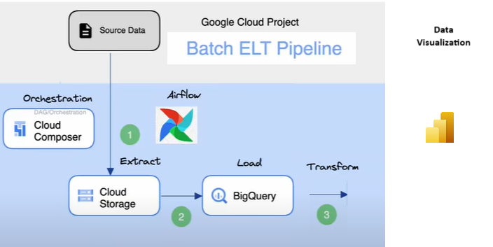
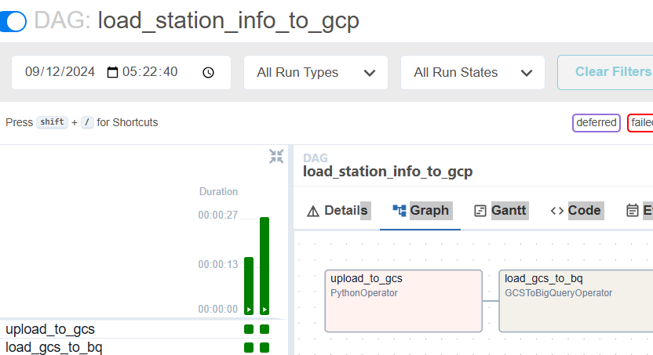
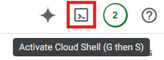
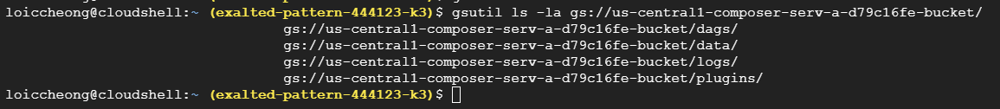
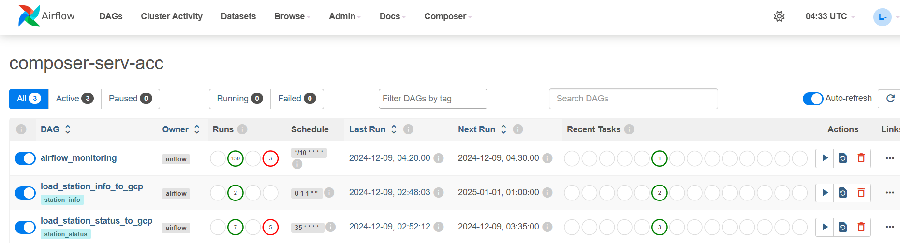
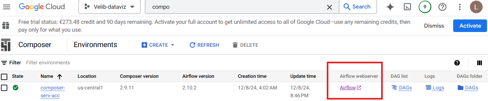
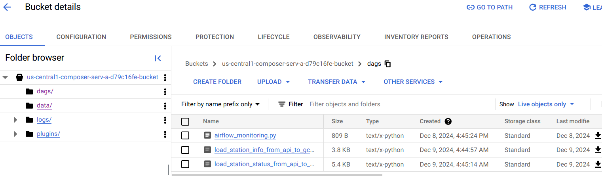
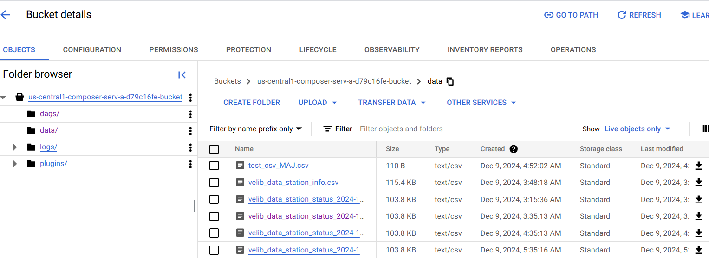
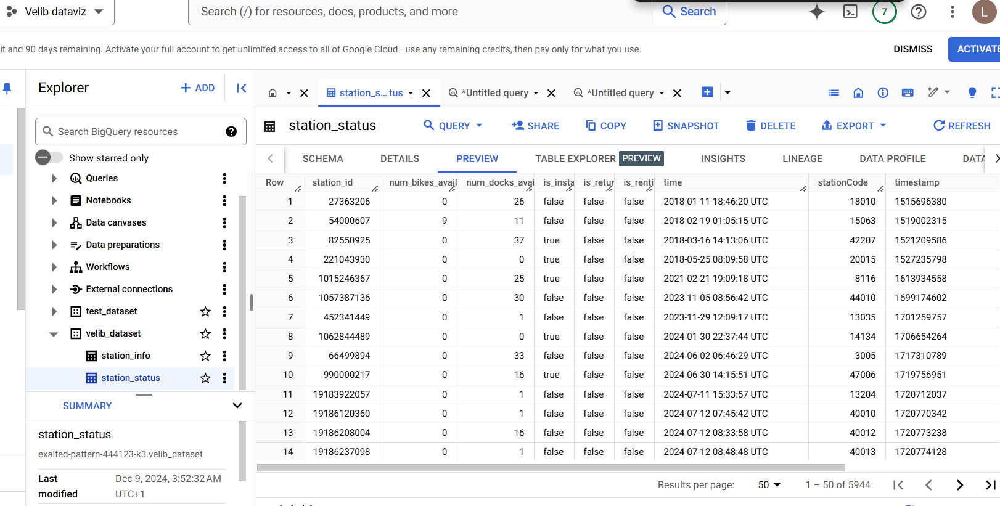

# Velib_dataviz

## About the Data 
Data get from the Open Data of  La Ville de Paris : https://www.velib-metropole.fr/donnees-open-data-gbfs-du-service-velib-metropole

API used : 
- https://velib-metropole-opendata.smovengo.cloud/opendata/Velib_Metropole/station_status.json
- https://velib-metropole-opendata.smovengo.cloud/opendata/Velib_Metropole/station_information.json

**Station Info**
- station_id: Unique identification number of the station. This number identifies the station within the Vélib’ Métropole service.
- is_installed: Binary variable indicating whether the station has been deployed (1) or is still being deployed (0).
- is_renting: Binary variable indicating whether the station can rent bikes (is_renting=1 if the station status is "Operative").
- is_returning: Binary variable indicating whether the station can receive bikes (is_returning=1 if the station status is "Operative").
- last_reported: Date of the last update.
- numBikesAvailable: Number of bikes available.
- num_bikes_available: Number of bikes available.
- numDocksAvailable: Number of docks available.
- num_bikes_available_types: Number of bikes available, with a distinction between mechanical and electric Vélib’ bikes.

**Station Status**
- capacity: Number of docks at the station.
- lat: Latitude of the station (in WGS84 format).
- lon: Longitude of the station (in WGS84 format).
- name: Name of the station.
- station_id: Unique identifier associated with the station. This number identifies the station within the Vélib’ Métropole service.

How is the data manipulated ?
With python scripts (DAGs), data will be added first in GCS then in BigQuery. At the end, it will be used for analysis
<p align="center">
  
  
</p>


## Google Cloud Platform (GCP)

### Install a Composer Environment
A Composer Environment is a service cloud to manage pipeline of workflows with Airflows
It automates scripts with a scheduler

1. First, create an account at GCP. Personnaly, I used a free-trial account
    Create a project. Give it a name. Select your project
2. Go to **API & Services** and activate the **API Cloud Composer**
3. Go to **IAM & Admin** and create a service account : 
    - Enter the name of the service account 
    - Grant the following roles to the new service account :
        * Environment and Storage Object Administrator
        * Editor
        * Service Account User 
        * Logs Viewer
        * Composer Worker 
        * Cloud Composer v2 API Service Agent Extension
        - Storage Admin (permission to load data from GCS)
        - Cloud SQL Admin
        - Bigquery Admin
4. At the Cloud Console, enter `Composer`, then click it
5. Create a new Cloud Composer Environment 
6. Choose the following setting : 
    - Choose Composer 2
    - Choose a name to your Composer Environment 
    - Choose a location
    - Choose latest airflow version
    - Choose the service account you previously created
    - Choose environment resources
    - Keep the rest of the defaults settings
    - Click on create
7. The Composer Environment takes ~25min to be created
8. When you create a composer environment, it also create a bucket where your dags are
9. Open the Cloud Shell on GCP and run the command `gsutil ls -la`. It gives the list of bucket folders at the Google Cloud Storage

### Clone this repo

On GCP, open the Cloud Shell (top right) and add this repo
```bash
git clone https://github.com/CheongLoic/Velib_dataviz.git
cd Velib_dataviz
```

<p align="center">
  
  
  
</p>

Move all python scripts in `/dags` to your `<bucket>/dags`
```bash
gsutil cp dag/<DAG_name.py>   gs://<votre-bucket-composer>/dags/<nom_du_dag>.py  #télécharger un dag spécifique dans le bucket
gsutil cp dag/*  gs://<votre-bucket-composer>/dags/  #télécharger tous les dags  dans le bucket
gsutil cp gs://<votre-bucket-composer>/dags/<nom_du_dag>.py /  #Récupérer un dag du bucket localement 
```

<!-- <p align="center"> -->
<!-- </p> -->
To access to Airflow, go the Cloud Composer and click on 'Airflow'



What you have in your bucket : 




On Bigquery : 

   

## Data visualization 
Possibles objectifs à résoudre : 
- Optimisation de l'emplacement des stations
- Prévision de la demande de vélos
- Analyse de l'utilisation des vélos
- Amélioration de la gestion de l'infrastructure
-  Évaluation de la performance du service
- Étude de l'accessibilité et de l'équité 
- Évaluation des comportements des utilisateurs
- Optimisation des coûts opérationnels
- Impact de la météo sur l'utilisation des vélos


<!-- Create table in Bigquery
1. Navigate to BigQuery Console : Go to the [BigQuery page](https://console.cloud.google.com/bigquery) in the Google Cloud Console.
2. Select Dataset : Choose the dataset where you want to load the data.
3. Create Table : Click the “Create Table” button.
4. Source : Choose “Google Cloud Storage” as the source.
5. File Format : Select the format of your file (e.g., CSV, JSON, Avro, Parquet, ORC).
6. GCS URI : Enter the URI of your GCS file (e.g., `gs://bucket-name/file-name`).
7. Schema : Define the schema manually or use the auto-detect feature.
8. Create Table : Click “Create Table” to load the data. -->


CURRENTLY DOING IT

<!---

python -m venv env

source env/bin/activate

AIRFLOW_VERSION=2.10.3

# Extract the version of Python you have installed. If you're currently using a Python version that is not supported by Airflow, you may want to set this manually.
# See above for supported versions.
PYTHON_VERSION="$(python -c 'import sys; print(f"{sys.version_info.major}.{sys.version_info.minor}")')"

CONSTRAINT_URL="https://raw.githubusercontent.com/apache/airflow/constraints-${AIRFLOW_VERSION}/constraints-${PYTHON_VERSION}.txt"
# For example this would install 2.10.3 with python 3.8: https://raw.githubusercontent.com/apache/airflow/constraints-2.10.3/constraints-3.8.txt

pip install "apache-airflow==${AIRFLOW_VERSION}" --constraint "${CONSTRAINT_URL}"


# airflow standalone


airflow users create \
    --username cheongloic \
    --firstname loic \
    --lastname cheong\
    --role Admin \
    --email cheongloic@gmail.com

airflow webserver
airflow scheduler


systemctl --user start docker-desktop


airflow docker credentials: 
- user : airflow
- password : airflow


loic-cheong@loic-cheong-VirtualBox:~$ docker ps
Cannot connect to the Docker daemon at unix:///home/loic-cheong/.docker/desktop/docker.sock. Is the docker daemon running?


install airflow with docker : https://airflow.apache.org/docs/apache-airflow/stable/howto/docker-compose/index.html

-->


